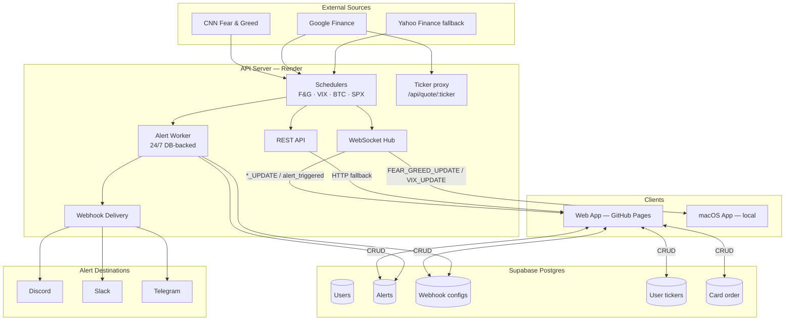

# fg-index

Real-time market dashboard with customisable alerts and webhook notifications. Track the CNN Fear & Greed Index, CBOE VIX, BTC, S&P 500, and any stock or crypto ticker — all in one place, with cross-device sync when signed in.

## Live

| App | URL |
|-----|-----|
| Web dashboard | https://itswcl.github.io/fg-index/ |
| API | https://fg-index.onrender.com |

---

## Features

### Market data
- **Four default indicators** — CNN Fear & Greed (30 min), CBOE VIX (10 sec, market hours), BTC (30 sec, 24/7), S&P 500 (10 sec, market hours)
- **Custom tickers** — Add any stock or crypto symbol (e.g. `AAPL`, `ETH-USD`); backend proxies Google/Yahoo Finance, 15s server cache, 30s client refetch
- **Real-time streaming** — WebSocket push for all indicators; TanStack Query HTTP polling fallback if WS disconnects
- **Smooth animations** — Price changes animate between frames instead of snapping

### Layout
- **Responsive grid** — 4-column desktop, 2-column tablet
- **Drag-to-reorder** — `@dnd-kit` grid, order persists per user
- **Mobile line-item view** — <640px switches to compact rows with opt-in edit mode so native scroll isn't hijacked by drag

### Alerts & notifications
- **Threshold alerts** — Multiple conditions per alert, `AND` / `OR` logic (e.g. `F&G < 10 AND VIX > 30`)
- **Per-alert cooldown** — Default 5 min, configurable
- **24/7 server-side worker** — Alerts fire even when the browser is closed; server loads all users' alerts from DB and evaluates on every indicator update
- **Webhook delivery** — Discord, Slack, or Telegram

### Accounts & sync
- **Google sign-in** — Supabase auth, JWT-gated server APIs
- **Cross-device persistence** — Alerts, webhook config, custom tickers, and card order sync via Postgres (Supabase)
- **Logged-out fallback** — LocalStorage is used when anonymous; a one-time migration seeds the server on first sign-in

### UX polish
- Dark / light / system theme
- Buy Me a Coffee support button
- Graceful error surfacing for save/test failures
- Fixed-height cards prevent flicker during refreshes

---

## Monorepo Structure

```
apps/
  api-server/     Node.js/Express — REST + WebSocket + alert worker (Render + Supabase Postgres)
  web/            React + Vite web app (GitHub Pages)
  macos-app/      React Native macOS companion (local/legacy)
packages/
  shared-types/   Zod schemas + TypeScript types shared across apps
```

---

## Architecture



---

## Getting Started

### Prerequisites

- Node.js ≥ 20
- npm ≥ 10
- A Supabase project (free tier works) if you want auth + persistence; the app runs read-only without it.

### API Server

```bash
cd apps/api-server
cp .env.example .env.local   # or create manually — see table below
npm install
npx prisma migrate deploy    # apply DB migrations
npm run dev
# REST + WebSocket on http://localhost:8080
```

**Environment variables** (`apps/api-server/.env.local`):

| Variable | Default | Description |
|----------|---------|-------------|
| `PORT` | `8080` | HTTP + WS port |
| `INTERNAL_API_KEY` | `dev-key-123` | Legacy API key for public read endpoints |
| `CORS_ORIGIN` | `*` | Comma-separated allowed origins |
| `CNN_FEAR_GREED_URL` | — | CNN DataViz endpoint |
| `GOOGLE_FINANCE_VIX_URL` | — | Google Finance VIX page |
| `YAHOO_FINANCE_VIX_URL` | — | Yahoo Finance VIX fallback |
| `GOOGLE_FINANCE_BTC_URL` | — | Google Finance BTC page |
| `YAHOO_FINANCE_BTC_URL` | — | Yahoo Finance BTC fallback |
| `GOOGLE_FINANCE_SPX_URL` | — | Google Finance S&P 500 page |
| `YAHOO_FINANCE_SPX_URL` | — | Yahoo Finance S&P 500 fallback |
| `SCRAPER_USER_AGENT` | — | Browser User-Agent for scraping |
| `FEAR_GREED_INTERVAL_MS` | `1800000` | F&G polling (30 min) |
| `VIX_REALTIME_INTERVAL_MS` | `10000` | VIX during market hours (10 sec) |
| `VIX_FALLBACK_INTERVAL_MS` | `300000` | VIX outside market hours (5 min) |
| `BTC_INTERVAL_MS` | `30000` | BTC polling (30 sec, 24/7) |
| `SPX_INTERVAL_MS` | `10000` | S&P 500 polling (10 sec, market hours) |
| `DATABASE_URL` | — | Supabase pooled connection (pgBouncer) |
| `DIRECT_URL` | — | Supabase direct connection (for migrations) |
| `SUPABASE_URL` | — | Supabase project URL |
| `SUPABASE_JWKS_URL` | — | Supabase JWKS endpoint for JWT verification |

### Web App

```bash
cd apps/web
npm install
npm run dev
```

Create `apps/web/.env.local`:

```
VITE_API_URL=http://localhost:8080
VITE_API_KEY=dev-key-123
VITE_SUPABASE_URL=https://<project>.supabase.co
VITE_SUPABASE_ANON_KEY=<anon-key>
```

| Variable | Description |
|----------|-------------|
| `VITE_API_URL` | Backend base URL |
| `VITE_API_KEY` | Sent as `X-API-KEY` for legacy public endpoints |
| `VITE_WS_URL` | Optional explicit WS URL (derived from `VITE_API_URL` if omitted) |
| `VITE_SUPABASE_URL` | Supabase project URL (enables sign-in) |
| `VITE_SUPABASE_ANON_KEY` | Supabase public anon key |

Without Supabase env vars, the app runs read-only with localStorage fallback (no cross-device sync).

### macOS App

See [`docs/README-macos-legacy.md`](docs/README-macos-legacy.md) for full setup (requires Xcode + CocoaPods).

---

## WebSocket Protocol

| Message | Direction | Description |
|---------|-----------|-------------|
| `FEAR_GREED_UPDATE` | Server → Client | New Fear & Greed snapshot |
| `VIX_UPDATE` | Server → Client | New VIX snapshot (payload may be `null`) |
| `BTC_UPDATE` | Server → Client | New BTC snapshot |
| `SPX_UPDATE` | Server → Client | New S&P 500 snapshot |
| `alert_triggered` | Server → Client | Alert condition matched (delivered regardless of client connection via server worker) |
| `set_alerts` | Client → Server | Legacy — alerts now persist via REST |
| `set_webhook` | Client → Server | Legacy — webhook now persists via REST |

---

## Alerts & Webhooks

Create alerts in the **Alerts** panel of the web app. Each alert has one or more conditions:

```
Fear & Greed < 10   AND   VIX > 30
```

**Operators:** `<` `>` `<=` `>=` `==`
**Logic:** `AND` (all must match) or `OR` (any triggers)
**Metrics:** `fearGreed`, `vix`, `btc`, `spx`, or `ticker:<SYMBOL>`
**Cooldown:** configurable per alert (default 5 min) to avoid notification spam

Alerts are evaluated server-side on every indicator update against all users' alerts — you'll still get notified if your browser is closed.

### Webhook Setup

| Platform | Required | Where to get it |
|----------|---------|-----------------|
| **Discord** | Webhook URL | Server Settings → Integrations → Webhooks |
| **Slack** | Incoming Webhook URL | api.slack.com → Your Apps → Incoming Webhooks |
| **Telegram** | Bot Token + Chat ID | Token: @BotFather · Chat ID: @userinfobot |

Configure in the web app: **Alerts → ⚡ Webhook**. Use the "Test" button to verify delivery.

---

## API Reference

### Public (API-key gated)

| Endpoint | Method | Description |
|----------|--------|-------------|
| `/api/fear-greed` | GET | Fear & Greed snapshot (30 min cache) |
| `/api/vix` | GET | VIX snapshot (5 min cache outside market hours) |
| `/api/btc` | GET | BTC snapshot (30 sec cache) |
| `/api/spx` | GET | S&P 500 snapshot (10 sec cache) |
| `/api/quote/:ticker` | GET | Arbitrary ticker proxy (15 sec cache, rate-limited 30/min) |
| `/api/health` · `/health` | GET | Health check |
| `/api/webhooks/test` | POST | Fire a test webhook (rate-limited) |

All public endpoints require the `X-API-KEY` header in production.

### Authenticated (Supabase JWT)

| Endpoint | Method | Description |
|----------|--------|-------------|
| `/api/alerts` | GET · POST | List / create alerts |
| `/api/alerts/bulk` | POST | Bulk replace alerts |
| `/api/alerts/:id` | PUT · DELETE | Update / delete alert |
| `/api/webhooks/me` | GET · PUT · DELETE | Get / upsert / delete webhook config |
| `/api/webhooks/me/test` | POST | Fire a test with the stored config |
| `/api/user/preferences` | GET · PUT | Card order (`string[]`) |
| `/api/user/tickers` | GET · POST · PUT · DELETE `/:symbol` | Custom ticker list (max 8/user) |

Send `Authorization: Bearer <supabase-access-token>` from the client.

---

## Database

PostgreSQL (Supabase) via Prisma. Core models:

| Model | Purpose |
|-------|---------|
| `User` | Mirrors Supabase `auth.users.id`; owns alerts/webhook/tickers/preferences |
| `Alert` + `Condition` | User-defined threshold alerts with AND/OR logic |
| `WebhookConfig` | One webhook destination per user (Discord/Slack/Telegram) |
| `UserTicker` | Custom tickers with position |
| `cardOrder` (on User) | Array of card IDs in user's drag order |

Run migrations:

```bash
cd apps/api-server
npx prisma migrate dev    # development
npx prisma migrate deploy # production (Render build step)
```

---

## Deployment

| Service | Platform | Trigger |
|---------|----------|---------|
| API Server | Render (free tier) | Push to `main` |
| Web App | GitHub Pages | Push to `main` |
| Database | Supabase Postgres | — |
| Keep-alive | GitHub Actions cron (every 14 min) | Pings `/health` to prevent Render sleep |

The keep-alive workflow is resilient to GitHub schedule drops — if a tick is missed it catches up on the next run.

---

## Contributing

```bash
git fetch origin
git checkout -b feat/your-change origin/main   # always branch from fresh main
# make changes, test locally
cd apps/api-server && npx tsc --noEmit && npx vitest run --exclude 'src/__tests__/integration/**' --exclude 'src/services/cnn.test.ts'
cd ../web && npx tsc --noEmit && npx vite build
git push origin feat/your-change
# open PR → review → squash merge → delete branch
```

**Workflow rules**
- One PR per task — never bundle unrelated changes
- Always branch from fresh `origin/main` (even for follow-up fixes)
- Squash commits to 1 before opening the PR
- CI runs on every PR: lint, type-check, unit tests
