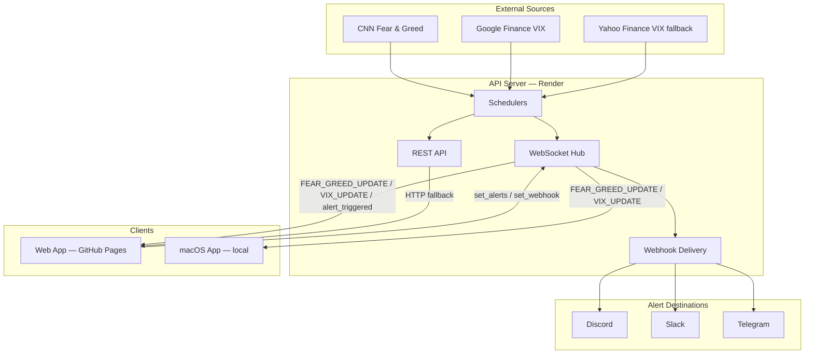

# fg-index

Real-time Fear & Greed Index + VIX dashboard with customisable market alerts and webhook notifications.

## Live

| App | URL |
|-----|-----|
| Web dashboard | https://itswcl.github.io/fg-index/ |
| API | https://fg-index.onrender.com |

---

## Features

- **Real-time data** — CNN Fear & Greed Index (30 min) + CBOE VIX (10 sec) streamed over WebSocket
- **HTTP fallback** — TanStack Query polling if WebSocket disconnects
- **Custom alerts** — Threshold conditions with AND / OR logic (e.g. `F&G < 10 AND VIX > 30`)
- **Webhook notifications** — Receive alerts via Discord, Slack, or Telegram
- **Dark / light mode** — Follows system preference

---

## Monorepo Structure

```
apps/
  api-server/     Node.js/Express — REST API + WebSocket server (Render)
  web/            React + Vite web app (GitHub Pages)
  macos-app/      React Native macOS desktop companion (local)
packages/
  shared-types/   Zod schemas + TypeScript types shared across apps
```

---

## Architecture



---

## Getting Started

### API Server

```bash
cd apps/api-server
cp .env.example .env.local
npm install
npm run dev
# Runs on http://localhost:8080 (REST + WebSocket on same port)
```

**Environment variables** (`apps/api-server/.env.local`):

| Variable | Default | Description |
|----------|---------|-------------|
| `PORT` | `8080` | HTTP + WS port |
| `INTERNAL_API_KEY` | `dev-key-123` | API key — auth skipped in dev |
| `CORS_ORIGIN` | `*` | Allowed CORS origin |
| `CNN_FEAR_GREED_URL` | — | CNN DataViz endpoint |
| `GOOGLE_FINANCE_VIX_URL` | — | Google Finance VIX page |
| `YAHOO_FINANCE_VIX_URL` | — | Yahoo Finance VIX fallback |
| `SCRAPER_USER_AGENT` | — | Browser User-Agent for scraping |
| `FEAR_GREED_INTERVAL_MS` | `1800000` | F&G polling interval (30 min) |
| `VIX_REALTIME_INTERVAL_MS` | `10000` | VIX real-time polling (10 sec) |
| `VIX_FALLBACK_INTERVAL_MS` | `300000` | VIX fallback interval (5 min) |

---

### Web App

```bash
cd apps/web
npm install
npm run dev
```

Create `apps/web/.env.local`:

```
VITE_API_URL=http://localhost:8080
VITE_API_KEY=dev-key-123
```

| Variable | Description |
|----------|-------------|
| `VITE_API_URL` | Backend base URL |
| `VITE_API_KEY` | Sent as `X-API-KEY` header |
| `VITE_WS_URL` | Optional explicit WS URL (derived from `VITE_API_URL` if omitted) |

---

### macOS App

See [`docs/README-macos-legacy.md`](docs/README-macos-legacy.md) for full setup (requires Xcode + CocoaPods).

---

## WebSocket Protocol

| Message | Direction | Description |
|---------|-----------|-------------|
| `FEAR_GREED_UPDATE` | Server → Client | New Fear & Greed snapshot |
| `VIX_UPDATE` | Server → Client | New VIX snapshot (payload may be `null`) |
| `alert_triggered` | Server → Client | Alert condition matched |
| `set_alerts` | Client → Server | Register alert configs for this connection |
| `set_webhook` | Client → Server | Register webhook config for this connection |

---

## Alerts & Webhooks

Create alerts in the **Alerts** panel of the web app. Each alert has one or more conditions:

```
Fear & Greed < 10   AND   VIX > 30
```

**Operators:** `<` `>` `<=` `>=` `==`
**Logic:** `AND` (all must match) or `OR` (any triggers)

### Webhook Setup

| Platform | Required | Where to get it |
|----------|---------|-----------------|
| **Discord** | Webhook URL | Server Settings → Integrations → Webhooks |
| **Slack** | Incoming Webhook URL | api.slack.com → Your Apps → Incoming Webhooks |
| **Telegram** | Bot Token + Chat ID | Token: @BotFather · Chat ID: @userinfobot |

Configure in the web app: **Alerts → ⚡ Webhook**.

---

## API Reference

| Endpoint | Method | Description | Cache |
|----------|--------|-------------|-------|
| `/api/fear-greed` | GET | Fear & Greed snapshot | 30 min |
| `/api/vix` | GET | VIX snapshot | 5 min |
| `/health` | GET | Health check | — |

All endpoints require `X-API-KEY` header in production.

---

## Deployment

| Service | Platform | Trigger |
|---------|----------|---------|
| API Server | Render (free tier) | Push to `main` |
| Web App | GitHub Pages | Push to `main` |
| Keep-alive | GitHub Actions cron (every 14 min) | Pings `/health` to prevent Render sleep |

---

## Contributing

```bash
git checkout -b feat/your-change   # branch off main
# make changes, test locally
git push origin feat/your-change
# open PR → review → merge → delete branch
```

CI runs on every PR: lint, type-check, unit tests.
