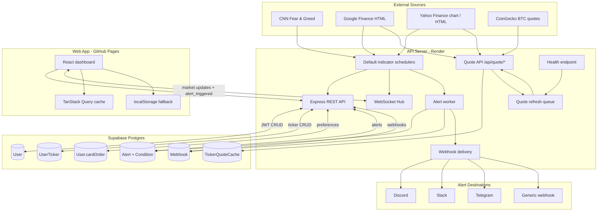

# fg-index

Real-time market dashboard for sentiment, volatility, crypto, indices, and custom tickers. The web app tracks the CNN Fear & Greed Index, VIX, BTC, S&P 500, and up to 32 user-defined symbols, with signed-in sync, server-side alerts, and webhook notifications.

## Live

| App | URL |
|-----|-----|
| Web dashboard | https://itswcl.github.io/fg-index/ |
| API | https://fg-index.onrender.com |

---

## Current Product

### Market Data

- **Default cards** - CNN Fear & Greed, CBOE VIX, BTC, and S&P 500.
- **Custom ticker cards** - Up to 32 tickers per user; supports stocks, indices, futures-style Yahoo symbols such as `ES=F`, and the BTC crypto quote `BTC-USD`.
- **Batch quote loading** - Visible custom tickers are fetched with `GET /api/quote/batch`, capped at 12 symbols per page, instead of one request per card.
- **Persistent quote cache** - Custom ticker responses are stored in Postgres via `TickerQuoteCache`; request handlers serve the latest known quote while a bounded refresh queue updates stale symbols in the background.
- **Source links** - Cards and mobile rows can open their source page when the backend provides `sourceUrl`.
- **After-hours context** - Custom equity quotes can carry `marketSession`, pre-market, and post-market fields; the UI shows a moon badge and paints the extended-hours price when the data is available.
- **Last-known display** - The frontend hydrates cached quotes from localStorage and keeps good quotes visible through transient scraper misses instead of flashing to empty states.

### Dashboard UX

- **Desktop grid** - Drag-to-reorder card grid with 12 cards per page and up to 3 pages.
- **Mobile line-item layout** - Phones switch to compact metric rows with swipe pagination and an explicit edit mode for reorder/delete so normal vertical scrolling remains reliable.
- **Stable loading states** - Initial signed-in hydration pads the grid/list with placeholders so cards and pagination do not jump as preferences and tickers load.
- **Theme support** - Dark, light, and system theme modes.
- **Connection status** - WebSocket status is debounced so short reconnects do not flash error states.

### Accounts, Alerts, and Notifications

- **Supabase Google sign-in** - Authenticated APIs use Supabase JWTs.
- **Cross-device sync** - Alerts, webhook destinations, custom ticker list, and card order persist in Supabase Postgres.
- **Signed-in alerting** - The current web UI gates alert and webhook management behind Google sign-in.
- **Anonymous fallback** - LocalStorage backs unsigned ticker/order sessions and acts as the migration source for older local alerts after sign-in.
- **Server-side alerts** - Alerts are stored in Postgres and evaluated by the API server on each default market-data update, so delivery does not depend on the browser staying open.
- **Multi-webhook delivery** - Each user can save up to 10 webhook destinations. Supported types are Discord, Slack, Telegram, and generic JSON POST.
- **Fan-out notifications** - Triggered alerts deliver to every enabled webhook for that user and also push `alert_triggered` to any live authenticated WebSocket connections.

---

## Monorepo Structure

```text
apps/
  api-server/     Express REST + WebSocket API, schedulers, alert worker, Prisma/Postgres
  web/            React + Vite dashboard deployed to GitHub Pages
  macos-app/      React Native macOS legacy companion
packages/
  shared-types/   Zod schemas and TypeScript types shared by web and API
docs/
  *.md            Product specs and historical design notes
```

The active product is the web app plus API server. The macOS app is retained as legacy code; see [`docs/README-macos-legacy.md`](docs/README-macos-legacy.md).

---

## Architecture



### Data Flow

1. Default indicator schedulers keep in-memory caches warm and broadcast `FEAR_GREED_UPDATE`, `VIX_UPDATE`, `BTC_UPDATE`, and `SPX_UPDATE` over WebSocket.
2. Custom ticker requests read from `TickerQuoteCache` first, enqueue refresh work, and return a quote or `null` without blocking on a slow upstream scrape.
3. The quote worker periodically syncs all active `UserTicker` symbols and refreshes stale cache rows with bounded concurrency and per-symbol failure cooldown.
4. Authenticated users persist alerts, webhook destinations, card order, and tickers through REST APIs.
5. The alert worker evaluates default-market alerts on scheduler updates and fans out delivery to all enabled webhook destinations.

---

## Data Sources and Resilience

| Area | Primary path | Fallback / guard |
|------|--------------|------------------|
| Fear & Greed | CNN DataViz JSON | In-memory scheduler cache |
| VIX | Google Finance with forced English locale | Yahoo Finance HTML fallback |
| S&P 500 | Google Finance with forced English locale | Yahoo Finance HTML fallback |
| BTC | CoinGecko simple price | None |
| Custom stocks/indices | Google Finance parser | Yahoo chart/HTML, exchange suffix resolution, last-known cache |
| Custom quote serving | Postgres `TickerQuoteCache` | Background refresh queue with cooldown and health stats |

Scraping remains the highest operational risk. Parser tests cover known Google/Yahoo shapes, and `validateTickerQuote` enforces a complete-quote-or-null contract so `NaN` or partial numeric payloads do not reach clients.

---

## Getting Started

### Prerequisites

- Node.js 20 recommended. The workspace declares `>=18`, but CI and runtime checks use Node 20.
- npm 10 recommended.
- Supabase project for auth and persistence.
- Postgres connection strings for Prisma migrations.

### API Server

Create `apps/api-server/.env.local`:

```bash
CNN_FEAR_GREED_URL=https://production.dataviz.cnn.io/index/fearandgreed/graphdata/
GOOGLE_FINANCE_VIX_URL=https://www.google.com/finance/quote/VIX:INDEXCBOE
YAHOO_FINANCE_VIX_URL=https://finance.yahoo.com/quote/%5EVIX/
GOOGLE_FINANCE_BTC_URL=https://www.google.com/finance/quote/BTC-USD
YAHOO_FINANCE_BTC_URL=https://finance.yahoo.com/quote/BTC-USD
GOOGLE_FINANCE_SPX_URL=https://www.google.com/finance/quote/.INX:INDEXSP
YAHOO_FINANCE_SPX_URL=https://finance.yahoo.com/quote/%5EGSPC/
SCRAPER_USER_AGENT=Mozilla/5.0 ...
DATABASE_URL=postgresql://...
DIRECT_URL=postgresql://...
SUPABASE_URL=https://<project>.supabase.co
SUPABASE_JWKS_URL=https://<project>.supabase.co/auth/v1/.well-known/jwks.json
```

Run locally:

```bash
cd apps/api-server
npm install
npm install --prefix ../../packages/shared-types
npx prisma generate
npx prisma migrate dev
npm run dev
```

The API and WebSocket server run on the same port, defaulting to `http://localhost:8080`.

### API Environment Variables

| Variable | Default | Description |
|----------|---------|-------------|
| `PORT` | `8080` | HTTP + WebSocket port |
| `INTERNAL_API_KEY` | `dev-key-123` | API key for public read endpoints; the default key disables API-key enforcement in dev |
| `CORS_ORIGIN` | `*` | Comma-separated allowed origins |
| `CNN_FEAR_GREED_URL` | required | CNN Fear & Greed JSON endpoint |
| `GOOGLE_FINANCE_VIX_URL` | required | Google Finance VIX page |
| `YAHOO_FINANCE_VIX_URL` | required | Yahoo VIX fallback |
| `GOOGLE_FINANCE_BTC_URL` | required | Legacy BTC URL env required by config |
| `YAHOO_FINANCE_BTC_URL` | required | Legacy BTC URL env required by config |
| `GOOGLE_FINANCE_SPX_URL` | required | Google Finance S&P 500 page |
| `YAHOO_FINANCE_SPX_URL` | required | Yahoo S&P 500 fallback |
| `SCRAPER_USER_AGENT` | required | Browser User-Agent for upstream requests |
| `FEAR_GREED_INTERVAL_MS` | `1800000` | Fear & Greed scheduler interval |
| `VIX_REALTIME_INTERVAL_MS` | `10000` | VIX realtime loop interval before adaptive throttling |
| `VIX_FALLBACK_INTERVAL_MS` | `300000` | VIX fallback refresh interval |
| `BTC_INTERVAL_MS` | `60000` | BTC scheduler interval |
| `SPX_INTERVAL_MS` | `10000` | S&P 500 realtime loop interval before adaptive throttling |
| `QUOTE_REFRESH_INTERVAL_MS` | `30000` | Active custom ticker sync interval |
| `QUOTE_REFRESH_CONCURRENCY` | `2` | Max concurrent background quote refresh workers |
| `QUOTE_REFRESH_SPACING_MS` | `3000` | Minimum spacing between background quote refresh starts to avoid provider bursts |
| `QUOTE_REFRESH_FAILURE_COOLDOWN_MS` | `60000` | Per-symbol refresh cooldown after failure |
| `BACKGROUND_DB_FAILURE_COOLDOWN_MS` | `60000` | Shared cooldown for background DB jobs after Supabase/Prisma connectivity failures |
| `QUOTE_STOCK_CACHE_TTL_MS` | `60000` | Freshness TTL for stock/index quote cache rows before background refresh refetches upstream |
| `QUOTE_MEMORY_CACHE_TTL_MS` | `120000` | In-process quote read cache TTL to reduce database egress |
| `QUOTE_NULL_CACHE_TTL_MS` | `120000` | In-process null quote cache TTL to avoid repeated database misses |
| `ACTIVE_SYMBOL_CACHE_TTL_MS` | `300000` | In-process active ticker symbol cache TTL for background scheduler scans |
| `ALERT_CANDIDATE_CACHE_TTL_MS` | `300000` | In-process enabled alert candidate cache TTL for alert worker DB reads |
| `QUOTE_FETCH_TIMEOUT_MS` | `5000` | Upstream fetch timeout for quote sources |
| `QUOTE_PRICE_SANITY_MAX_MOVE_PERCENT` | `100` | Reject quote refreshes whose price moves by this percent or more from the previous cached price; set `0` to disable |
| `AUTH_USER_UPSERT_TTL_MS` | `300000` | In-memory TTL for skipping repeated authenticated user upserts |
| `MASSIVE_API_KEY` | empty | Optional Massive API key for low-frequency market-session status refreshes |
| `MASSIVE_MARKET_STATUS_URL` | `https://api.massive.com/v1/marketstatus/now` | Massive market-status endpoint |
| `MARKET_STATUS_REFRESH_ENABLED` | `true` | Set `false` to disable Massive market-session refreshes |
| `DATABASE_URL` | required | Supabase pooled Postgres connection |
| `DIRECT_URL` | required | Direct Postgres connection for migrations |
| `SUPABASE_URL` | required | Supabase project URL |
| `SUPABASE_JWKS_URL` | required | Supabase JWKS endpoint for JWT verification |

### Web App

Create `apps/web/.env.local`:

```bash
VITE_API_URL=http://localhost:8080
VITE_API_KEY=dev-key-123
VITE_SUPABASE_URL=https://<project>.supabase.co
VITE_SUPABASE_ANON_KEY=<anon-key>
```

Run locally:

```bash
cd apps/web
npm install
npm run dev
```

| Variable | Description |
|----------|-------------|
| `VITE_API_URL` | Backend base URL |
| `VITE_API_KEY` | Sent as `X-API-KEY` for public read endpoints |
| `VITE_WS_URL` | Optional explicit WebSocket URL; derived from `VITE_API_URL` if omitted |
| `VITE_SUPABASE_URL` | Supabase project URL for sign-in |
| `VITE_SUPABASE_ANON_KEY` | Supabase public anon key |

Without Supabase env vars, market data still works, but signed-in persistence and server-side alert/webhook management are unavailable.

---

## API Reference

### Public Read APIs

These endpoints are API-key gated in production and skip API-key enforcement when `INTERNAL_API_KEY=dev-key-123`.

| Endpoint | Method | Description |
|----------|--------|-------------|
| `/api/fear-greed` | `GET` | Latest Fear & Greed scheduler cache |
| `/api/vix` | `GET` | Latest VIX scheduler cache |
| `/api/btc` | `GET` | Latest BTC scheduler cache |
| `/api/spx` | `GET` | Latest S&P 500 scheduler cache |
| `/api/quote/:ticker` | `GET` | Cached custom quote snapshot; enqueues refresh |
| `/api/quote/batch?symbols=AAPL,MSFT` | `GET` | Up to 12 deduped quote snapshots in one response; enqueues refresh for all |
| `/api/webhooks/test` | `POST` | Legacy ad-hoc webhook test body, API-key gated and rate-limited |
| `/api/health` | `GET` | Scheduler and quote-refresh health |
| `/health` | `GET` | Backward-compatible health alias |

Batch quote response (quote shape abbreviated here; real quotes include `previousClose`, `change`, `changePercent`, and `fetchedAt`):

```json
{
  "quotes": {
    "AAPL": { "ticker": "AAPL", "price": 182.1 },
    "BAD": null
  }
}
```

### Authenticated APIs

Send `Authorization: Bearer <supabase-access-token>`.

| Endpoint | Method | Description |
|----------|--------|-------------|
| `/api/alerts` | `GET` / `POST` | List or create alerts |
| `/api/alerts/bulk` | `POST` | Replace all alerts for migration |
| `/api/alerts/:id` | `PUT` / `DELETE` | Update or delete an alert |
| `/api/webhooks` | `GET` / `POST` | List or create webhook destinations |
| `/api/webhooks/:id` | `PUT` / `DELETE` | Update or delete one webhook destination |
| `/api/webhooks/:id/test` | `POST` | Test one saved webhook destination |
| `/api/webhooks/me` | `GET` / `PUT` / `DELETE` | Legacy single-webhook alias mapped to the user's oldest webhook row |
| `/api/webhooks/me/test` | `POST` | Legacy test endpoint for the oldest webhook row |
| `/api/user/preferences` | `GET` / `PUT` | Persist `cardOrder` |
| `/api/user/tickers` | `GET` / `POST` / `PUT` | List, add, or bulk-replace custom tickers |
| `/api/user/tickers/:symbol` | `DELETE` | Remove a custom ticker |

### WebSocket Protocol

The WebSocket server runs on the same host/port as HTTP. Browser clients pass auth through query params because custom headers are not available during the WebSocket handshake.

| Message | Direction | Description |
|---------|-----------|-------------|
| `FEAR_GREED_UPDATE` | Server to client | New Fear & Greed snapshot |
| `VIX_UPDATE` | Server to client | New VIX snapshot |
| `BTC_UPDATE` | Server to client | New BTC snapshot |
| `SPX_UPDATE` | Server to client | New S&P 500 snapshot |
| `alert_triggered` | Server to client | Authenticated user's alert matched |

Client-to-server WebSocket messages are no longer part of the active protocol. Alerts and webhooks persist through REST APIs.

---

## Alerts and Webhooks

Alerts are created in the web app's Alerts panel. Each alert supports:

- 1 to 5 conditions.
- `AND` or `OR` logic.
- Operators: `<`, `>`, `<=`, `>=`, `==`.
- Metrics: `fearGreed`, `vix`, `btc`, and `spx`.
- Per-alert cooldown from 0 minutes to 7 days, defaulting to 5 minutes.

Example:

```text
Fear & Greed < 10 AND VIX > 30
```

Webhook destinations support:

| Type | Required fields |
|------|-----------------|
| Discord | Webhook URL |
| Slack | Incoming webhook URL |
| Telegram | Bot token and chat ID |
| Generic | Webhook URL; receives JSON |

---

## Database

PostgreSQL is accessed through Prisma. Core models:

| Model | Purpose |
|-------|---------|
| `User` | Supabase user mirror with email and `cardOrder` |
| `UserTicker` | Per-user custom ticker list and order |
| `TickerQuoteCache` | Persistent quote snapshots plus refresh metadata |
| `Alert` / `Condition` | Server-side threshold alerts |
| `Webhook` | N-per-user webhook destinations |

Run migrations:

```bash
cd apps/api-server
npx prisma migrate dev      # development
npx prisma migrate deploy   # production
```

---

## Deployment and CI

| Area | Platform | Trigger / Notes |
|------|----------|-----------------|
| API server | Render | Deployed from `main` |
| Web app | GitHub Pages | `.github/workflows/deploy-frontend.yml` on push to `main` or manual dispatch |
| Database | Supabase Postgres | Prisma migrations from API workspace |
| CI | GitHub Actions | Type-checks API/web, runs API tests, builds web |
| Uptime | External monitor | Render keep-awake is handled outside this repo; the old GitHub cron workflow was removed |

Useful verification commands:

```bash
cd apps/api-server
npm install --prefix ../../packages/shared-types
npm install
npx tsc --noEmit
npx vitest run

cd ../web
npm install
npm run lint
npm run build
```

Workflow rules:

- One PR per task; do not bundle unrelated changes.
- Branch from fresh `origin/main`.
- Keep review branches to one commit unless the reviewer asks otherwise.
- Preserve the public response contracts for default cards: VIX returns `ticker: "VIX"`, S&P 500 returns `ticker: "SPX"`, and BTC returns the canonical BTC quote.
