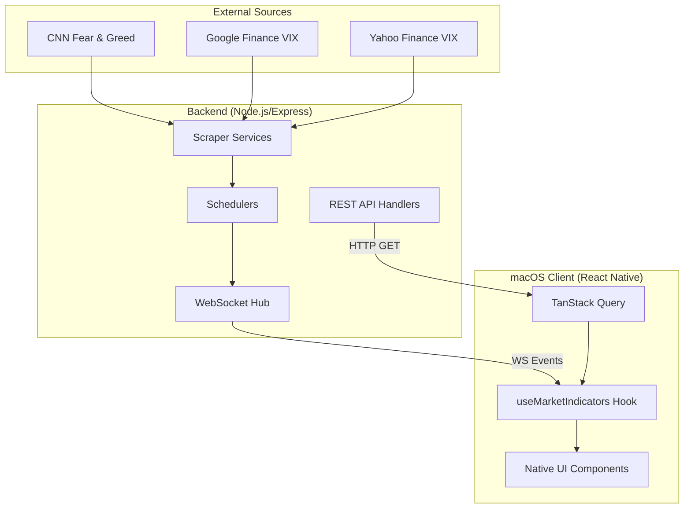

> **Archived** — Original macOS-only README, kept for historical reference. See root [README.md](../README.md) for current documentation.

# Fear & Greed & VIX index macOS App

A native macOS application providing real-time financial sentiment metrics, including the CNN Fear & Greed Index and the Volatility Index (VIX).

## Project Overview

This project is a full-stack monorepo designed for low-latency market sentiment tracking. It features a Node.js backend that aggregates data from multiple financial sources and a native macOS frontend built with React Native.

### Key Features

- **Real-time Updates**: Live scores pushed via WebSockets.
- **Native macOS Experience**: Hover states, platform-specific typography, and system dark/light mode support.
- **Resilient Data Flow**: WebSocket primary transport with automatic REST API fallbacks and manual refresh capabilities.
- **Compact UI**: Designed to fit unobtrusively on the desktop.

---

## Architecture Diagram



---

## Data Flow

1. **Ingestion**: The Backend Schedulers trigger Scraper Services at defined intervals (e.g., 30 mins for F&G, 10 seconds for VIX).
2. **Distribution**:
   - **Push**: Updates are broadcast immediately to all connected macOS clients via WebSockets (`WS_PORT: 8081`).
   - **Pull**: The macOS app uses TanStack Query as a fallback to fetch the latest data via REST API if the WebSocket is disconnected or stale.
3. **Manual Trigger**: Users can press the refresh button in the macOS app, which triggers a manual REST request to fetch the most recent cached data from the server.

---

## Technical Stack

- **Frontend**: React Native macOS, TypeScript, TanStack Query.
- **Backend**: Node.js, Express, `ws` (WebSockets), Zod (Validation).
- **Shared**: Common TypeScript types and schemas in `packages/shared-types`.

---

## Getting Started

### Prerequisites

- [Node.js](https://nodejs.org/) (v18+)
- [Xcode](https://developer.apple.com/xcode/) (for macOS development)
- [CocoaPods](https://cocoapods.org/)
- [pnpm](https://pnpm.io/) (used for monorepo management)

### 1. Run the Local Backend Server

The backend is a Node.js service that provides both a REST API for data fetching and a WebSocket server for real-time updates.

```bash
# Navigate to the api-server directory
cd apps/api-server

# Install dependencies
npm install

# Start the server in development mode (with auto-reload)
npm run dev
```

Once running, the backend exposes:

- **REST API**: `http://localhost:8080`
- **WebSockets**: `ws://localhost:8081`

The server will automatically begin scraping market data (Fear & Greed and VIX) upon startup.

### 2. Set up the macOS App

```bash
cd apps/macos-app
npm install
cd macos && pod install && cd ..
```

### 3. Run the App

To start the Metro bundler:

```bash
npm run start -- --port 8081
```

To launch the application, open `apps/macos-app/macos/macos-app.xcworkspace` in Xcode and click **Run**, or use the CLI:

```bash
xcodebuild -workspace apps/macos-app/macos/macos-app.xcworkspace \
           -scheme macos-app-macOS \
           -configuration Debug build
```

---

## Configuration

Environment variables are managed via `.env.local` files in each app directory.

**Backend (.env.local):**

- `PORT`: REST API port (default 8080)
- `WS_PORT`: WebSocket port (default 8081)
- `FEAR_GREED_INTERVAL_MS`: Scraping frequency for Fear & Greed.
- `VIX_REALTIME_INTERVAL_MS`: Scraping frequency for VIX.
